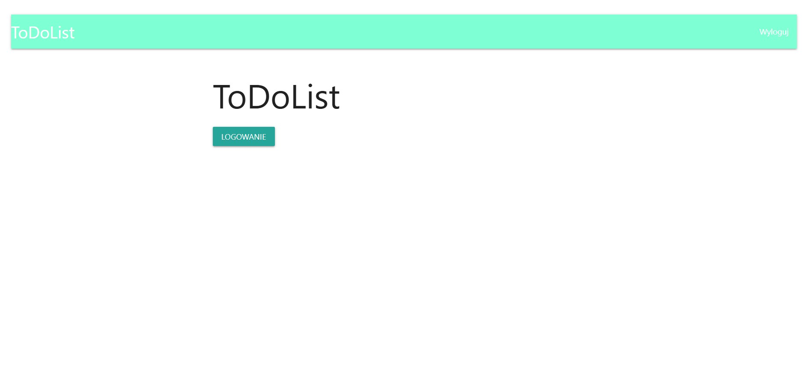
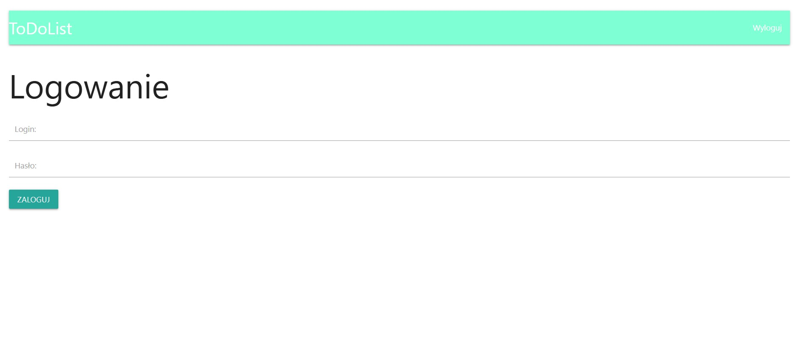
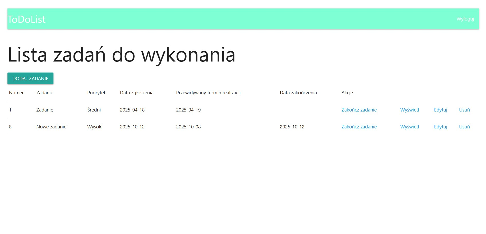
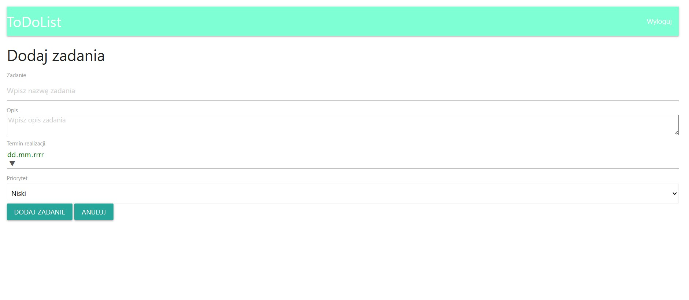
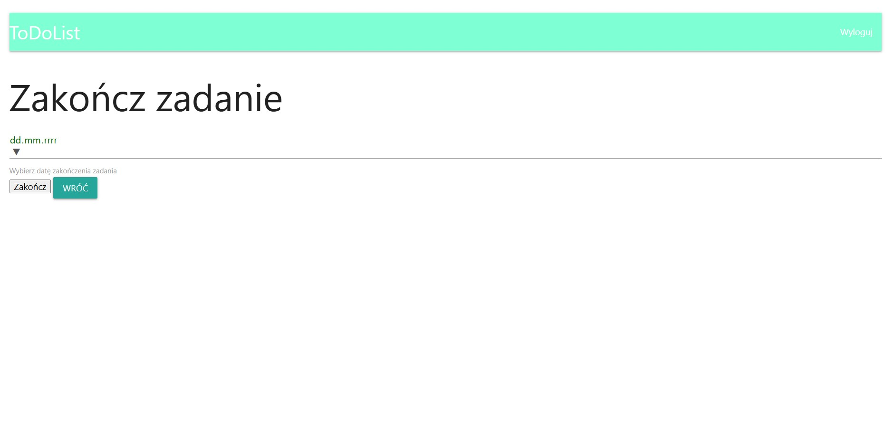
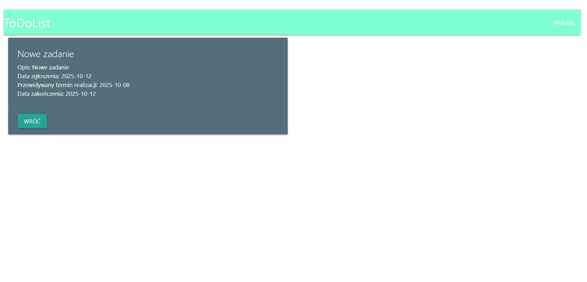
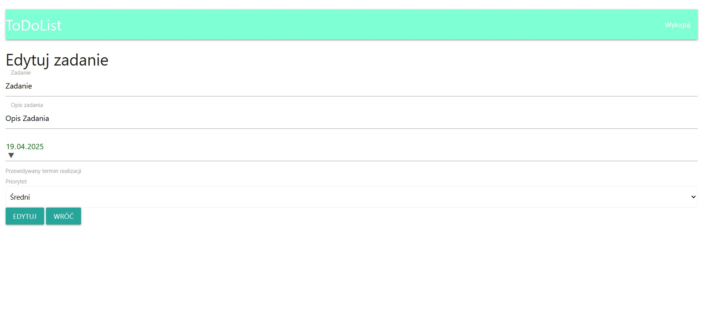

# ToDoList

ToDoList is an application written primarily in C#, but also in HTML and CSS. It is used to create to-do list after logging in.

  
  

After login, you have a page with all the tasks:

  

The application offers several activities on tasks:
- add ("DODAJ ZADANIE"),
- finish ("Zakończ zadanie"), 
- see details ("Wyświetl"),
- edit ("Edytuj"),
- delete ("Usuń").

  
  

  
  

